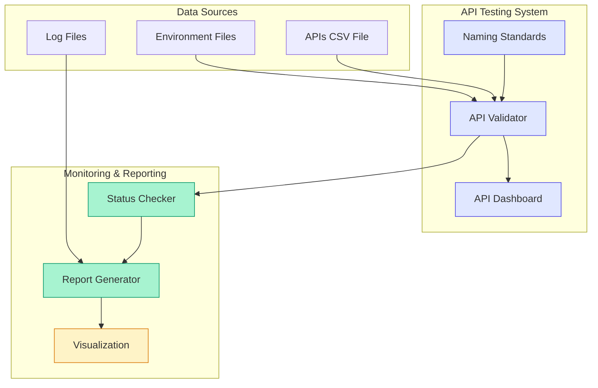

# API Testing & Management Architecture

## Component Details

1. **Naming Standards System**
   - Standardized API naming conventions
   - Category management
   - Validation rules

2. **API Validation**
   - Automated testing
   - Status checking
   - Error handling

3. **Dashboard**
   - Real-time status display
   - Integration points
   - Health monitoring

4. **Reporting**
   - Status reports
   - Error tracking
   - Integration analysis
