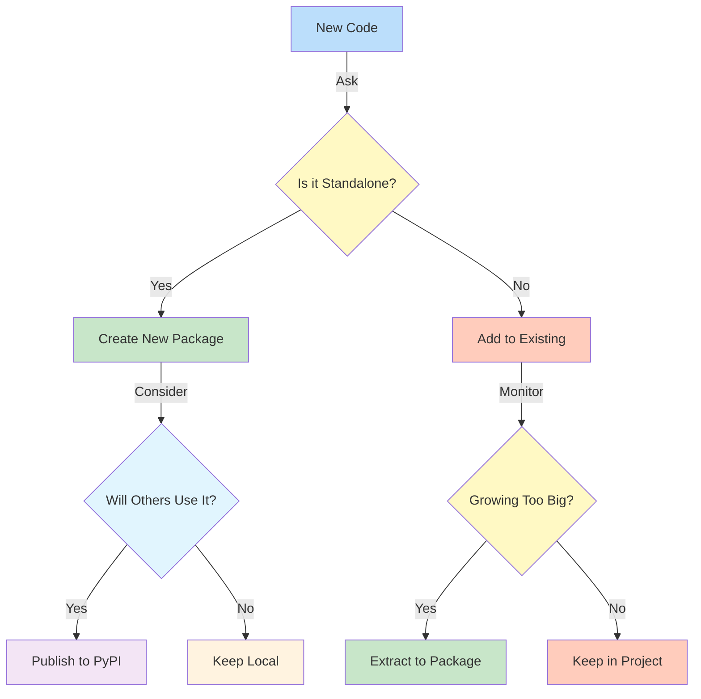
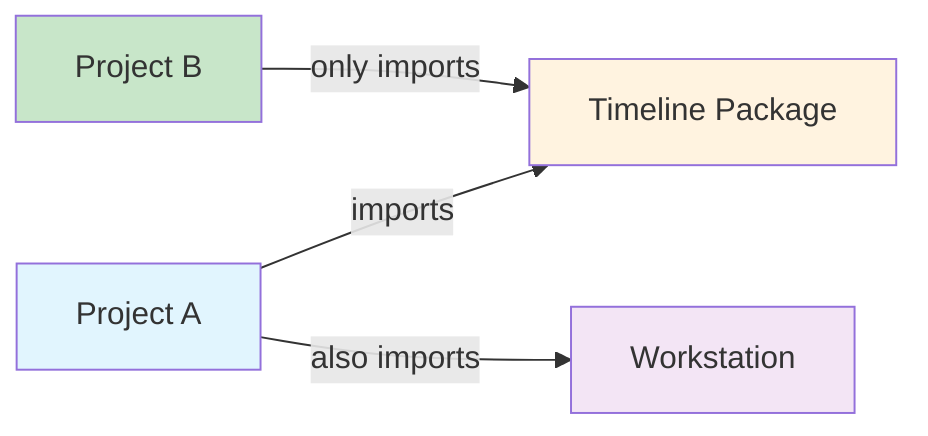
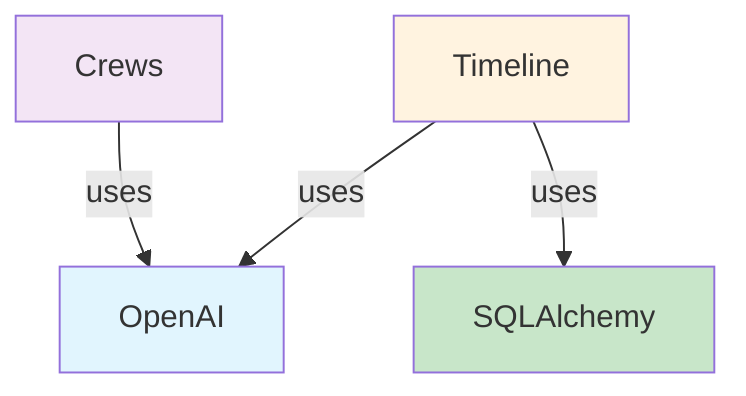
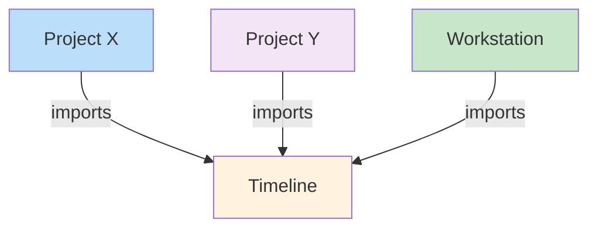

# Package Decision Making Guide

## Decision Flow


## Import Examples

### 1. Timeline in Workstation 🏢
```python
# In workstation/some_script.py
from workstation.timeline import TimelineWatcher
from workstation.crews import BaseCrew

# Initialize timeline
watcher = TimelineWatcher()
```

### 2. Timeline as Standalone 📦
```python
# In another_project/script.py
from timeline import TimelineWatcher

# No access to crews package
watcher = TimelineWatcher()
```

### 3. Mixed Usage Example 🔄


## Directory Structure Examples

### 1. Timeline in Workstation 📁
```
WORKSTATION/
├── 📄 pyproject.toml
├── 👮 timeline/
│   ├── __init__.py
│   ├── watcher.py
│   └── models.py
└── 🚒 crews/
    ├── __init__.py
    └── base_crew.py
```

### 2. Timeline as Package 📦
```
timeline-package/
├── 📄 pyproject.toml
├── 👮 timeline/
│   ├── __init__.py
│   ├── watcher.py
│   └── models.py
└── 📝 README.md
```

## Common Scenarios

### 1. Shared Dependencies 🤝


### 2. Independent Usage 🔄


## Decision Checklist

### When to Keep in Workstation ✅
- [ ] Tightly coupled with other workstation modules
- [ ] Shares many dependencies
- [ ] Primarily for internal use
- [ ] Rapid development needed

### When to Extract to Package ✅
- [ ] Other projects need it
- [ ] Clear boundaries
- [ ] Minimal dependencies
- [ ] Well-defined interface

### When to Publish ✅
- [ ] Useful for others
- [ ] Well documented
- [ ] Stable API
- [ ] Good test coverage 