# Package Usage Scenarios

## Scenario 1: Timeline as Part of Workstation 🏢

```mermaid
graph TD
    A[🏢 Workstation] -->|contains| B[👮 Timeline]
    A -->|contains| C[🚒 Crews]
    A -->|has| D[pyproject.toml]
    D -->|installs| B
    D -->|installs| C
    
    style A fill:#e1f5fe
    style B fill:#fff3e0
    style C fill:#f3e5f5
    style D fill:#e8f5e9
```


### Usage:
```python
# Import from workstation installation
from workstation.timeline import TimelineWatcher
```

## Scenario 2: Timeline as Standalone 👮

```mermaid
graph TD
    A[👮 Timeline Package] -->|has own| B[pyproject.toml]
    A -->|can be used by| C[🏢 Other Projects]
    A -->|can be| D[Published to PyPI]
    
    style A fill:#fff3e0
    style B fill:#e8f5e9
    style C fill:#e1f5fe
    style D fill:#f3e5f5
```


### Usage:
```python
# Direct import after installing timeline
from timeline import TimelineWatcher
```

## Best Practices Decision Flow


## Recommendations:

1. **Start in Workstation** 🏢
   - Easier development
   - Shared dependencies
   - Quick iterations

2. **Extract if Needed** 📦
   - When conflicts arise
   - When reuse elsewhere needed
   - When size becomes unwieldy

3. **Consider Publishing** 🚀
   - When fully mature
   - When widely reusable
   - When well-documented

## Directory Structure Examples

### In Workstation:
```
WORKSTATION/
├── 📄 pyproject.toml
├── 👮 timeline/
└── 🚒 crews/
```

### Standalone:
```
timeline-package/
├── 📄 pyproject.toml
└── 👮 timeline/
```

## Import Patterns

### From Workstation:
```python
# When timeline is part of workstation
from workstation.timeline import TimelineWatcher

# Access to other workstation features
from workstation.crews import BaseCrew
```

### Standalone Timeline:
```python
# When timeline is standalone
from timeline import TimelineWatcher

# No access to workstation features
# Need separate installation of required packages
```

## Recommendations for Your Case:

1. **Keep in Workstation For Now** 🏢
   - Timeline and Crews are related
   - Shared development workflow
   - Easy to refactor later

2. **Extract When** 📤
   - Need to use Timeline elsewhere
   - Dependencies conflict
   - Size becomes unmanageable

3. **Monitor For** 👀
   - Dependency conflicts
   - Reuse needs
   - Maintenance overhead 