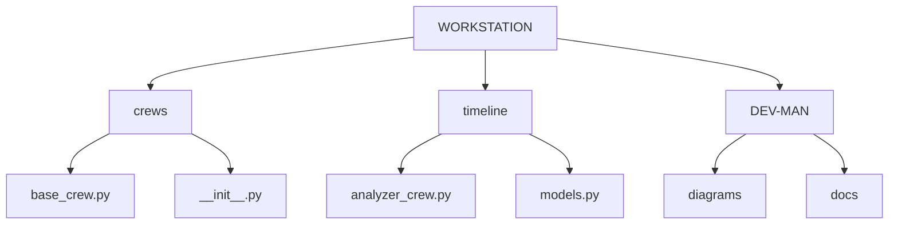

```mermaid
graph TD
    A[WORKSTATION] --> B[crews]
    A --> C[timeline]
    A --> D[DEV-MAN]
    B --> E[base_crew.py]
    B --> F[__init__.py]
    C --> G[analyzer_crew.py]
    C --> H[models.py]
    D --> I[diagrams]
    D --> J[docs]
``` 