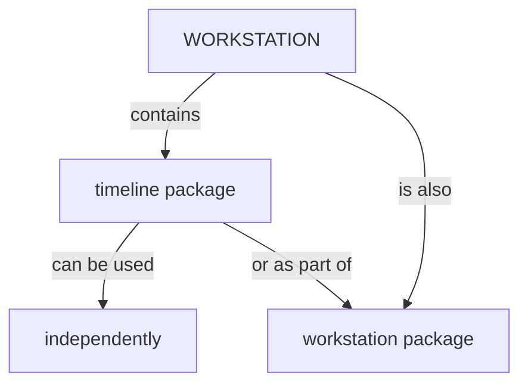

# Dual Package Setup Guide

## Package Structure


## Installation Options

### 1. Install Both (Recommended for Development)
```bash
# From WORKSTATION root
uv pip install -e .
```

### 2. Install Timeline Only (For External Use)
```bash
# From timeline directory
cd timeline
uv pip install -e .
```

## Usage Examples

### Using Timeline from Workstation
```python
# When installed as part of workstation
from workstation.timeline import TimelineWatcher

# Initialize
watcher = TimelineWatcher()
```

### Using Timeline Standalone
```python
# When installed independently
from timeline import TimelineWatcher

# Initialize
watcher = TimelineWatcher()
```

## Development Workflow

1. **Making Changes**
   ```bash
   # Changes to timeline/watcher.py
   # Will be reflected in both installations
   ```

2. **Testing Changes**
   ```bash
   # Test as part of workstation
   python -c "from workstation.timeline import TimelineWatcher"
   
   # Test standalone
   python -c "from timeline import TimelineWatcher"
   ```

## Best Practices

1. **Version Control**
   - Keep versions synchronized
   - Update both pyproject.toml files
   - Document dependencies in both places

2. **Testing**
   - Test both installation methods
   - Verify imports work in both contexts
   - Check for dependency conflicts

3. **Documentation**
   - Document both usage patterns
   - Keep READMEs in both locations
   - Explain relationship between packages

## Common Issues

1. **Import Conflicts**
   ```python
   # Wrong
   from timeline import TimelineWatcher  # When installed as workstation
   
   # Right
   from workstation.timeline import TimelineWatcher
   ```

2. **Dependency Management**
   ```toml
   # In timeline/pyproject.toml
   # Only timeline-specific dependencies
   
   # In workstation/pyproject.toml
   # All dependencies including timeline's
   ```

3. **Path Issues**
   ```python
   # Use proper relative imports
   from ..base_crew import BaseCrew  # In timeline package
   ```

## Verification Script
```python
def verify_packages():
    try:
        # Try workstation import
        from workstation.timeline import TimelineWatcher
        print("✅ Workstation package working")
        
        # Try standalone import
        from timeline import TimelineWatcher
        print("✅ Timeline package working")
        
    except ImportError as e:
        print(f"❌ Import failed: {e}")
``` 