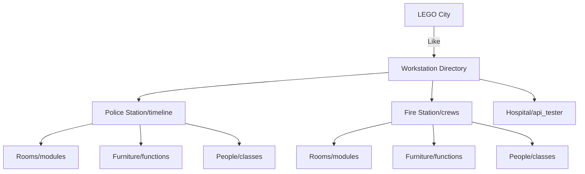
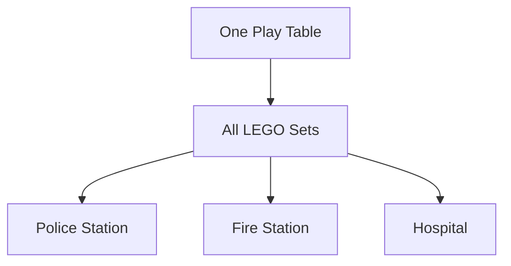
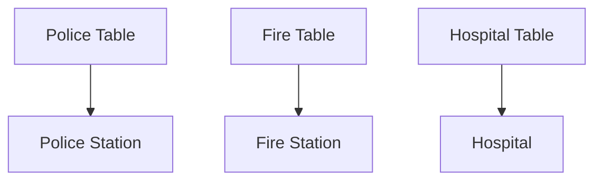

# Understanding Python Packages: The LEGO City Analogy

## LEGO City Structure


## Types of Code Organization

### 1. Script (Single LEGO Piece)
- A single file that does one thing
- Like a single LEGO police car
- Runs independently
- Example: `quick_test.py`

### 2. Module (LEGO Room)
- Collection of related scripts
- Like a room in LEGO police station
- Can be imported by other code
- Example: `timeline/watcher.py`

### 3. Package (LEGO Building)
- Collection of related modules
- Like a complete LEGO police station
- Has `__init__.py` file
- Example: `timeline/` directory

### 4. Project (LEGO City)
- Collection of packages
- Like your entire LEGO city
- Has `pyproject.toml`
- Example: `WORKSTATION/`

## Virtual Environments (LEGO Play Tables)

### Single Table Setup


### Multiple Tables Setup


## Package Installation Scenarios

### Scenario 1: Timeline as Part of Workstation
```
WORKSTATION/
├── pyproject.toml     # Main city blueprint
├── timeline/          # Police station
└── crews/            # Fire station
```

### Scenario 2: Timeline as Standalone
```
timeline/
├── pyproject.toml    # Just police station blueprint
└── src/             # Police station parts
```

## When to Use What

### Single Virtual Environment
- When all packages work together
- Like building all LEGO sets on one table
```bash
# One environment for all
uv venv .venv-workstation
```

### Multiple Virtual Environments
- When packages have conflicts
- Like having separate tables for each LEGO set
```bash
# Separate environments
uv venv .venv-timeline
uv venv .venv-crews
```

## Real Examples

### Script (Single Piece)
```python
# quick_test.py
def main():
    print("Hello")

if __name__ == "__main__":
    main()
```

### Module (Room)
```python
# timeline/watcher.py
class TimelineWatcher:
    def __init__(self):
        self.events = []
```

### Package (Building)
```
timeline/
├── __init__.py
├── watcher.py
└── models.py
```

### Project (City)
```
WORKSTATION/
├── pyproject.toml
├── timeline/
└── crews/
```

## Best Practices

1. **Package Organization**
   - Keep related code together (like LEGO sets)
   - Use clear names
   - Include documentation

2. **Environment Management**
   - One environment per project if possible
   - Separate environments for conflicting dependencies
   - Clear naming for environments

3. **Dependencies**
   - List all in pyproject.toml
   - Use version ranges
   - Document requirements

## Common Questions

1. **Where to put pyproject.toml?**
   - Root of the project (city blueprint)
   - Where you want to install from

2. **When to create new environment?**
   - Different Python versions needed
   - Conflicting dependencies
   - Isolated testing needed

3. **Package vs Script?**
   - Package: Reusable code (LEGO set)
   - Script: One-off task (single piece)

## Timeline Example

### As Part of Workstation
```bash
cd WORKSTATION
uv venv .venv
uv pip install -e .  # Installs everything
```

### As Standalone
```bash
cd timeline
uv venv .venv-timeline
uv pip install -e .  # Installs just timeline
``` 