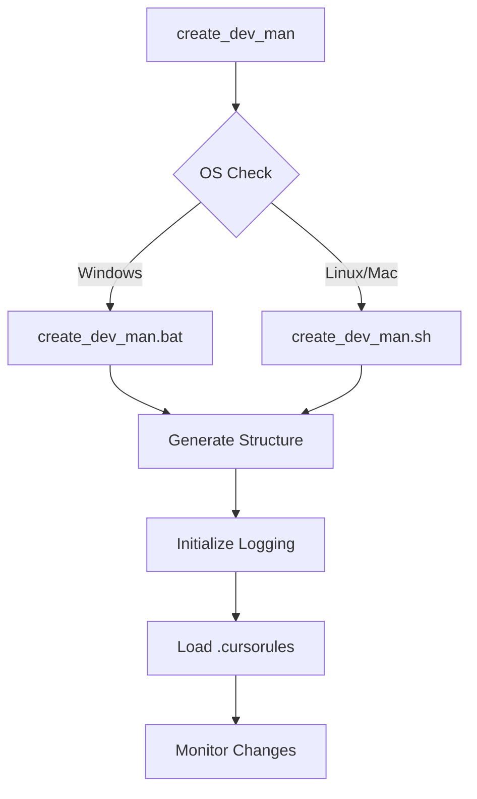

# Script Workflow Documentation

## Script Execution Flow

```mermaid
graph TD
    A[create_dev_man] --> B{OS Check}
    B -->|Windows| C[create_dev_man.bat]
    B -->|Linux/Mac| D[create_dev_man.sh]
    C --> E[Generate Structure]
    D --> E
    E --> F[Initialize Logging]
    F --> G[Load .cursorules]
    G --> H[Monitor Changes]
```

## New Script Structure

### 1. Main Controller Script 