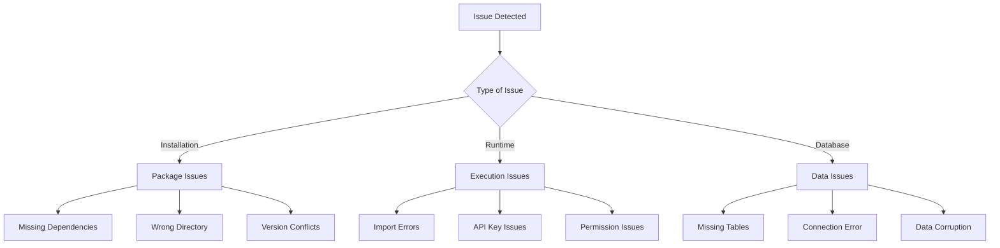
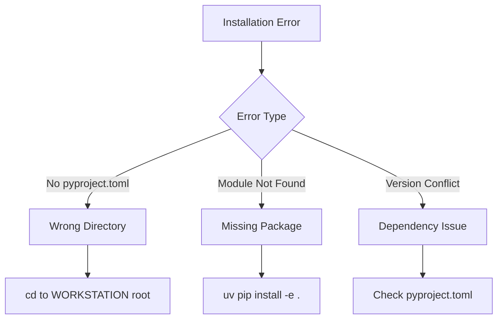

# Troubleshooting Guide

## Common Issues Flow

```mermaid
graph TD
    A[Issue Detected] --> B{Type of Issue}
    B -->|Installation| C[Package Issues]
    B -->|Runtime| D[Execution Issues]
    B -->|Database| E[Data Issues]
    
    C --> C1[Missing Dependencies]
    C --> C2[Wrong Directory]
    C --> C3[Version Conflicts]
    
    D --> D1[Import Errors]
    D --> D2[API Key Issues]
    D --> D3[Permission Issues]
    
    E --> E1[Missing Tables]
    E --> E2[Connection Error]
    E --> E3[Data Corruption]
```

## Installation Issues

```mermaid
graph TD
    A[Installation Error] --> B{Error Type}
    B -->|No pyproject.toml| C[Wrong Directory]
    B -->|Module Not Found| D[Missing Package]
    B -->|Version Conflict| E[Dependency Issue]
    
    C --> C1[cd to WORKSTATION root]
    D --> D1[uv pip install -e .]
    E --> E1[Check pyproject.toml]
```

## Quick Start Script 